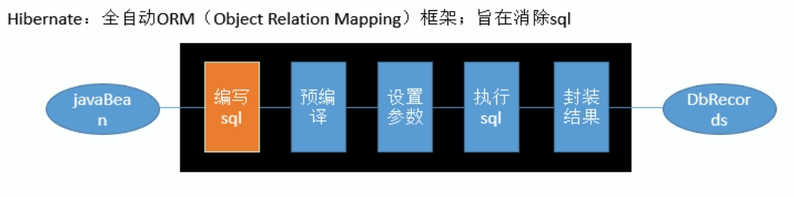

# Mybatis 学习笔记

## 传统数据操作方法

JDBC ==> DButils(QueryRunner) ==> JdbcTemplate

编写sql ==> 预编译 ==> 设置参数 ==> 执行sql ==> 封装结果

1. 传统方法的缺陷

   * 功能简单
   * sql语句编写在Java代码里面，后期维护难度大
   * 属于硬编码高耦合的方式

2. Hibernate：旨在消除sql

   

   缺陷：

   * sql优化和定制比较困难
   * 用Hibernate的`HQL`语言来优化和定制sql增加开发者的学习成本
   * HIbernate是全自动全映射的框架，对于大量字段的`POJO`进行部分映射时比较困难。而要定制映射关系要求开发者掌握`HQL`

## Mybatis 优势

1. sql与Java代码分离，用配置文件的方式交给开发人员定制，方便后期维护
2. 属于轻量级框架。学习成本低，只需要掌握sql而不用在学习而外的类似于`HQL`的语言

## Mybatis 语法规则

### 一、`XXXMapper.xml`

1. `namespace`名称空间

   名称空间要与所关联的`XXXMapper.java`的全类名保持一致.

2. 数据库中表的字段名必须与我们的`JavaBean`的属性名一致，如果不一致，可以通过为`sql`起别名的方式来实现。比如，`JavaBean`中的一个属性为`lastName`，而对应表的字段名为`last_name`，可以用下面的`sql`语句做别名处理。

   ```sql
   select id, last_name lastName, gender, email from tbl_employee where id = #{id};
   ```

   ​